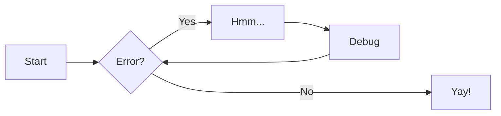

# neovim-for-beginner

Companion code for the [Medium Neovim for Beginners series.](https://alpha2phi.medium.com/learn-neovim-the-practical-way-8818fcf4830f#545a)

# Diagrams## Mermaid Diagram



# PlantUML Diagram

```plantuml
Bob -> Alice : hello

```
